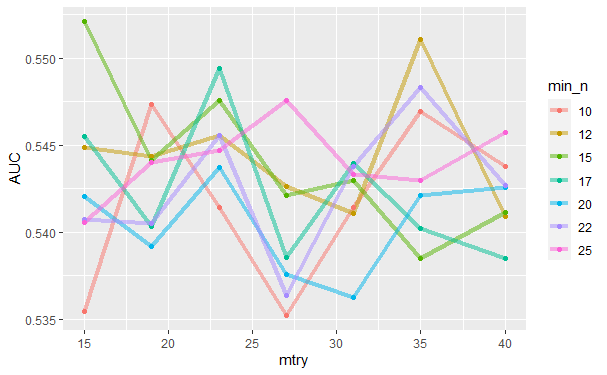

```{r setup, include=FALSE}
knitr::opts_chunk$set(echo = TRUE)
library(dplyr)
library(readr)
library(ggplot2)
library(ggthemes)
```


# Abstract

Twitch.tv is home to millions of internet communities, gamers, role-players, and athletes alike. With the emerging interest in live streaming on the internet, twitch has found itself being the largest online gaming streaming platform in history. A large proponent of twitch’s success on the internet is its live chat which gives its users the ability to interact with the broadcaster(streamer) in real-time using text and customized emojis, otherwise known to the community as emotes. These custom emotes are user-generated either by Twitch, Broadcasters, or Viewers. BetterTTV and FrankerFaceZ are important third-party features that allow these community-generated emotes to be used across Twitch.

Furthermore, twitch chat and its interaction with the video characteristics of broadcasts have received no attention in live streaming literature since broadcasts can go well beyond five hours. This project aims to build upon recent work regarding emote based sentiment, and community emote-profiles by including the chat interactions from the “Twitch Clip” tool. Twitch clips are user-generated “highlights” to capture important moments of the broadcast and commonly shared on platforms like YouTube and Reddit. Recently, twitch literature has begun characterizing twitch communities using twitch chat, viewership trends, and content but no known projects have used resources that exist outside of twitch to understand how twitch communities manifest and interact with one another. Studies that exist have predominantly used most viewed broadcasters with large communities to begin understanding twitch user behavior. It’s known that the size of communities on twitch plays a large role in how users behave in the chatroom. One way we can get insight into these differences between small and large communities is by analyzing reddit posts that feature “twitch clips”. One subreddit called LivestreamFails (LSF) is a dedicated subreddit where users share livestream and streamer related content. LSF is one way smaller streamers become noticed and is a platform that can be use to compare big and small communities. 

In this analysis will investigate features related to post virality (+-500 Karma) on LSF while building an R package to navigate the Twitch API and return chat information from Twitch Clips. Understanding the power of emotes and the influence that LSF has on the twitch community would be beneficial for growing streamers, company sponsors and Twitch so that they may grow the community and build products. The results are expected to extend our understanding of twitch emotes while also qualitatively and quantitatively characterizing twitch communities to improve twitch stream recommendation systems. This analysis impacts the Twitch, Reddit and R programming communties. 


# Preface

### What is a subreddit?

A subreddit can be thought of as a 'sub-community' which discuss and share topics relevant to the 'sub's' topic, name or description. For example, the coffee subreddit would be about all things coffee! It would include discussions about a specific roasting technique, coffee bean deals, or tools used to drink coffee to name a few. The subreddit that I will be investigating in this analysis is one called Livestreamfail, also know to the community as LSF. 


On LSF, you can find users discussing all things related to 'livestreaming'. The discussions can range from livestreams themselves to the streamers who do the broadcasting. 

My previous analysis of LSF indicated that the majority of topics discussed were 'Twitch Clips'. 

![](data:image/png;base64,iVBORw0KGgoAAAANSUhEUgAAB4AAAAZgCAMAAACoT6rCAAABp1BMVEUAAAAAADQAAF4ANjQANl4ANoMAYGIAYYMAYacAiKwdWwAdvtkfuLsjtrskvMoxuso0AAA0ADQ0AF40NgA0NjQ0Nl40NoM0YTQ0YV40YYM0Yac0iac0ick4uLg4uMo6xNU6xOc/uJg/wFxGvX9IwrZIyXlIyZ1SfwBdAABdNgBdNjRdNl5dYQBdYTRdYV5dYYNdiYNdiaddicldroNdrqddrsldrupjxXljxZ1wuLZwwHlwwJ10Nnp0Zqt00fB02bN02dd8Ozd/wTqAMV6AYY+DNgCDNjSDYQCDYTSDYV6DiTSDiV6DiaeDroODrsmDruqD0cmD0eqJjsOMuzqOkMqPjbyR1HWSj8OSk66YjsOdk9GkkrmklZulmMinYQCnYTSniTSniV6niYOnroOnrqenrsmn0YOn0aen0cmn0eqn86en88mn8+quouW6ncm/wfXGzHXIiTTIiV7Im5nIrl7IroPIrqfI0YPI0afI0cnI0erI86fI88nI8+rXgtDgwXXjl5nor+/prl7proPp0YPp0afp0cnp86fp88np8+rxtKv0qtP///9e7DVMAAAACXBIWXMAAB2HAAAdhwGP5fFlAAAgAElEQVR4nOzd75Pj5oHgd/Zoptwv2yfpziPPHzCjrG8tZzVXlRe57Iupk7MX5fQmL1v2rvfiuVVVtlVSVlY8tZXOjKbp5I8OwZ8gCJAgCOD5gc+ndt1kN5t88IDCdwCC7NkcABjb/zcLPQIAmCABBoAABBgAAhBgAAhAgAEgAAEGgAAEGAACEGAACECAASAAAQaAAAQYAAIQYAAIQIABIAABBoAABBgAAhBgAAhAgAEgAAEGgAAEGAACEGAACECAASAAAQaAAAQYAAIQYAAIQIABIAABBoAABBgAAhBgAAhAgAEgAAEGgAAEGAACEGAACECAASAAAQaAAAQYAAIQYAAIQIABIAAB7tvbm1nhyZsuv/titnbd+7gm45IVADAeAe7bBdv/9a8K8EUEGEhDoAA//G524KO//nK4B/zuZvb4dddffveiOtar3zTeWIAH1GY1CjCQhkABvjvs77Jrnw201VxulLtukt8/rxnqs6MPJcCDaLUaBRhIQ1wBns0efzXc4111vO/RAuw14BNarUYBBtIQW4BnVy+He7yOd31egC+16ocA17loNQLEJaLXgDcFHmIf+LIt91mvAV9KgJsJMJCRkGdB3+719qfv15kb4thhH1vuh1fFfTz6pqchNRHgZgIMZCSeAM+3B6YHOLorwFkQYCAjUQV4vYEdYBdYgLMgwEBG4grw6nSnyqvAP/3+06JJVx9/9mPTPX3/24+WN/nor/+x/gbRBfj7XxUD/uDp4VufWwf45EK30mJ2T3v4h199WIz6o1982eIfT8tlv3r6+vzH6SfA74ol/viPxcUfviiGsrq857wlAuggrgDXbGG/L58A9bjuozrefbF3ftTTL/ZPkfr2w+oZVKvTqH557ob1ZID3z9U6yMTD1+ufXBefJ7Edx+eVm5UD/LZ0j/sfQHFiodtqnN29ZVmP8fua7xV++HRvKK/3H6J8vt3LYha2y/7JOWugzWo8tgK2P/vlZjV88mY3vZWDLseXCKAXkQX4frnF270IfHD+8eHnIH17Mzu02/g2v+Hp3JeaTwW48m6laoBXv1742au9G1Y2/qUAv91btPIjn1jolppn923l/ou5qs7k+uEevqh8vxKs2/KvPPy+fMdnfDZZm9V4bAXUvZXsg9Ll8uSeWiKAXsQd4LrNbqWbX9fcpHwE97b254VzX2ruLcDHB1IK8P7ilx751EK3c2R22we4esvC3jotr4BfV4rffhW0WY3nBnjPbvJOLhFALyIL8P4h6Prdnk8Of+HI5jTCPeDjI2kR4JML3cqx2W0d4O9q76T8aSrN6ZydsdM+xB5w/VBOLxFAL+IK8CpSm29tNrofLM8P+un3m1cBS73abFc//nJ5k7/f7GGVWhTfa8DLhy+W6WH9qurefe4CvJ/s3fHaFgvdwvHZbfka8P3m6sfFuUoP21uUlqjmM1cefzl/96p+khr19hrw8uEfNv8sKBbj2/LstVgigF7EFeD78rZuvRdWOttnfe5S6VdWv3C1O3tovcGstmjUs6DvGx9su2N5vcnGKgTPDm5zXe5v5Uht24U+qsXsrkNfXpD7/Zts/imwG8vm9LLqweXSHuzqL24sl+7cqrVcjQ0r4L40tLelhV0txWrE7ZcI4EJRBXi9VVyFZN2fvUAffM7+4Ra5/l08kQV429+a4W6+s9tlqx4rb7vQpxem1eyWyrP+re0Drfcja9ZhdfF3Ad7syT98cf4fiOwjwKsVuB7my91SrRaz/RIBXCimAH+/twt2X7fZq37z7rBQt3Uby7gCfJC08t7VOqbbdyodnv/TdqFPj/HE7B7sAld2gGvTVN7PrI55duZ7j6r6CPCz0tDL/9Qr7xi3WSKAC0UT4O1HQW82focHZ3ff3e6CrYtQfi/tQ91bYqMK8N5bXg7utHL+U81mv+1CH9NqdtfXt0Oo7gCvq3pddyeV5V/f9OBdz+cZPMBnLBHAhYIH+MA6Cqu9r4PcVb69Pbn141//4U9HHiqqAJc376cCXHeqdtuFPqLd7O4dqJ0f7ACve1y9l70XEjbu9n+1o6EDfM4SAVwotgBvd5GaXtasHLfee3vK1ce/PvxQwdLN+g9wMcqGDX0fAb6q++Sv1gt9RMvZrewCV3aQ1/8QOLiXyn5zaciX7kMOHeBzlgjgQpEFeHdaTvUzsTaq2+CDO/ng85rt5EABXm6wD94i2l+Amzb57Rb6iLazu7cLvLpycJZ0g/1/qSQV4FZLBHChqAK8eoPKStO29iAdh5/KWPNC40ABru9Yj4egm84TbrXQR7Se3fK+X/UV4rqPjCoN6MSHfHcxdIDPWSKAC8UT4I/2/zJQ60TM9z9feOmT6m+lGuDGjX6bhT6i9eyWdoErLwif2l9MMcDnLBHAhYIHuGmr1vYg6dLD//l3v/qovK08/dbZ8wUJ8JE925MLfUT72d3tAh+8EOoQNMAFog3wagt58CLo/odVVvzpH367rlf1BskF+Mmb7WcSn+hq80If0X52t/u9BzvAxz7dOtEAn7NEABeKNsAP9R8WvNqIbsvx7U21IutP86hUK7kAX5d2haufXdF2oU8uy6nZXdq88ltzJnDNJ4I0SSPA5ywRwIWiDXD9O0ff7pfmvtqzecPOXYoBnr/bHBDdX5jWC31Mm9ktf/PqfznYAa77XJETjxd9gM9YIoALxRvg9etxj16XvrdO0nYDeVdzD+WP1t+q2XK/+/TMs2pGD/DuiOjeydCtF/qYNrO7Vj5XrvIIqx89btGrwQJctxq7B/iMJVr+5heLGz99fe5iABTiDXDNpxduPh95W7zb6i3mm79zV9lDvK9+890Xxx+8xvgBLv3VvNJAWy/0US1md29xZnULtfmbQvWfF3L4cJcGuOVqvCDA7ZdovvtXjB1moItAAa77I7Gvqzfa1Kf6F2t3u2HbPv36j8VN5n/6h0+PluLpH4tf/emHv9u8vNru1b79vzN7YHUn27+eULVp3Helv2i7flm39DvLv2v7dvtA13vj3ruj1gt93OnZXSudmXTws/vtnSxndv7wpz/94e///aeL+3q8juK7+vOazvvk6o2jq/H4Cij/PeDXu4ktSrtZwOWYTi/RzuYTyXxGJdBFoADvfZji2sGORMM5qaUK1H+a9KymFA23bJWs429OWW/+74/c4OXhIpc/+n97L6Xc1gV4fUftF/qo07O7sVu0w+mqW5Erq9XZPHedznQ6shqPr4C9cSz2mHcT+7I0E89aLFHNDPqMSqCLmAO8eomt6umb43dTv0WsD0G7z66ILMDtF/q4k7O7veGx0DT2anVcuOcAH1mNfQX41BK1nBeAU6IOcM1hxf3PpWjY6Nb9zdmaw8iPW73QFzTAld3Ul2cu9AknZndr84i1zXzbcHz+kxNz1+29Ps2rsbcAn1iiEoeggUvE/Brw8oZ7H7lY/rDopW9vZp/8UNmTazgr9eHrvVutXvpsJ9xrwHu7qZs7OmOhTzgxu9ub1f+Vvo3ygq19vL2rXl8Dnh9bjf28Bnx6iXachAVcIuRZ0C29+7tPi63l1cefvW66yQ+//Wi5Qf3g6J/me/h+9dGNi1v9YwYHDdst9CktZve0n/5+/aGYVx99/O//8x+HndxRVmO7JfI2JOACCQQYAPIjwAAQgAADQAACDAABCDAABCDAABCAAANAAAIMAAEIMAAEIMAAEIAAA0AAAgwAAQgwAAQgwAAQgAADQAACDAABCDAABCDAABCAAANAAAIMAAEIMAAEEE+A72fXoYfQq9iXJ/bxhWZ+gIFFGuC72ULvG8B3N7PZs8affv+ieNCPmm9wRM14j23Ab2ezR990eZwexRuYh+fHVlMr97O17f28W6zdD7486y5inR8gE0ECXIRwa1Oigw3ebfn63ZNeHvn988Yt+/3sl28uuu/b9gFeLI8A79lfv0dWUzv3V1/tf+PtzefF/zTe7eHzK675ATIUaA94t4VtLtF+gPsJVvOW/eHVpdvb23PuIHyA47I/H70HeH2Hb3/+Ve3NrQ8gAAE++ZO2BPgCAwf47snq6EbjOrI+gNEFD/C9ADN0gB9ere+v8dlmfQCjCx7glbqTrnZBu9+9Yrz53rfFy8gffPZmd4Mny9Oorn5T9/PFjz6dza6evm7Ysr9/vn2Al6vv/PT14g6uPvmx6f5r3DaeRLb49euHrxff+fj19gbFBn/5sKtU/PTF4vE+/ux3TS9174+nWKAPizPGvtyGo3T9/fokprc3m1fYD8Z/cnzF3V19VtzuycEr468Ws/R1cUbTuxfb3zg1X9X1sedg/S5W07vFCpt9slt/xfxs7qxmvNV73A/w25uXlQvHH39/fuqWt7o8p9YfwIGQAX7/fG9rWN2DPLYHfHv1+WLb98OLx6+3N3jy8PXjP27Os6n+/OvHXy72g37/8/++5R7w259/Xnz5bvea4f791zk2/lc/e7WIycPX26VYLc93q4cpwvB00a6ffn/TsAGvjuf9i8VY5g+Lwq3usXJ9uzC7aTsc/7HxLefrpy8e/8+1O4aLsj958/3N33z6+fz20Zu68Z1aHweqe8Af/bwYwKvH6+++evyfF/Pz/c22idX5rLi/+psi4E/X/yDYvvZbH+CDx1/azc/h8laX59T6AzgUNsB7MTsjwNtr6+1h8a3Hr5b7S9/9rzU/37wEuNiStgrwboO9Lcre/dc6GuD17tT2TK/lCO+2+2mb7zec7F0dz/aMsYdXyyWtXq8L8MH4j4xv82u39e+WentTzOft1ctN0U7NV836qqgG+Orl3nKubXdsD+az4n72tPgHydfr22+HVfk3X9Pjr8ZaCnBleQ+W58T6A6gRLMD779IstA/wbjP6sDuZa/ZJ489LWWgX4N12/XazRS3ff72jAV4P/24ToMXyLPLw+vABa1XHU+rq8g6r1+sCfDD+5vG92+wnvn/eEOCXm6GsLp6Yr7r1VdHwGvDdfrC3d3Qwnw3W//K6OMD7y3u4PBefQg9MUJJ7wKVTaXYb/CfNP7/bvo7ZfAS5PJjSgcrtPtfpfZujAd7sIW1Gdvfofy8fj72/+Xz38u6Bg/FUt/fV67WHoI+Nd398u/m7bRXgU/NVt74qGgO89/i7AFfns8F6ZD0H+HB5jq8/gDpJvgZ8V/4cj80u5ZPmn++2+u3Ogi6dwrNtS98Bns2uyku/POfoo7+u34pXx1PdjzzYr7wwwLvb1gfuIEgn5qtufVWcCPDD74tzzK4+ujkzwJv3/x4/Cav+jpoDXLM8R9cfQJ1IzoIunBHgms3u3ga/8vMoA/zJbfXTmuYP25Oy9lXHU12Kg6WKLcCn3+NzPMDvbj7+4yJ0D/8SSYAbHrVp/QHUSTLABx80OK8c8mz4GIaoDkF/81BzfLduyTI4BF27VHuOBnh7LtbZh6DXv9DpfcBHDkE3Lk+LJQVYSzLAdR8bWd7gV3/ey0lYvQd4MczH31S+3bCH3nwSVuX355W76RbgbecuOQnryPqocTTA28CfHeBNELt8ElZzgA+W59T6A6iRZIDn/8/N5lDfdud2LzDVn5/9NqTNFn+3RzNAgOfvX6zHdbf5/I/7We0h0up4Hp5frxf73YtnNdfn6z2+tzedAnz6bUiVAJ+ar5r1VdEqwA+vZu0CfLc+v+3d883bs57vn4x14vGXmgN8+Pw6sf4AaqQS4PfPn/w4n//p7z9cf7TTzdPVB080BLL68/M/iKP4kKPFL5Q+WOLUMp0f4MWDrt93u/7MiO+bjpBXx/NueQr1ww9frD8sqnr9/mq1vL/qFuDFfL1efg5G0wdxVIJ0cr4O11fF/vqt7sHfFosz//7Fv2v5GvDD18sP5fruZvfaQ/HBHu+azoE+eH4tH7Q5wNXlObn+AA4F/XOEu5cad2eVPqm7vvCw/CzCp5u/6Lr86MPZx6uriz2jjWd1P5+v/9hv8VGUs7p9lN1nEW6GtP5oxTdN97/vxPhv1x9sWHw25PIeNn8PeHm/y7N6/vj7j/bGW7U3nsLytOAPPvux4XrxUYkffPbmbvl4B+M/Nb7dR1HWBa64t0XZbovbLn5leZNT81VdHwdK63f1JvHN2cbLhn774fqTRJfjrBlv1bvi7j4onRL19sTfA957fu3PT+Pybpfn9PoDOBBoD5g0+BsFAEMRYI7w0YoAQxFgmjV+ciQAlxJgGr17cX38o5YB6EyAqbM8DenIHz8G4EICDAABCDAABCDAABCAAANAAAIMAAEIMAAEIMAAEIAAA0AAAgwAAQgwAAQgwAAQgAADQAACDAABCDAABCDAABCAAANAAAIMAAEIMAAEIMAAEIAAA0AAAgwAAQgwAAQgwAAQgAADQAACDAABCDAABCDAABCAAANAAAIMAAEIMAAEIMAAEIAAA0AAAgwAAQgwAAQgwAAQgAADQAACDAABCDAABCDA1PtLG6EHWfHPbYQe5KX+YxuhB9na/9hGyAH+322EHCApE2DqCXCkBHhUAsyABJh6lwb44dWTN8X/H3uMn2p+p/Ldg7uo/k5ZXwF+e3Ndc7FuNNUxHRtdTy4PcOdB3j76Zn3p1JptrWuAjzx1+l0HwwS4Zoy7yWU6BJh6IwT4239T2eQsb7//3epdHPxOWaAA78Z0dHQ9uTjA3QcZT4CPPHV6XgeDBLhujAI8RQJMvT4CfOIh6jc5+9+t3s3RzVSgAO/GNMZG9OIAdx9kPAE+8tTpeR0MEuC6MQrwFAkw9QS4erFmNNUxCfC5BPjY98idAFOva4DfvZjN/u3r0iHo20f/9PVs9vHiW/OHr2/Wl4orr2az2c+WG/L72bPlL/y5+L/Fd6/37mbxravflH7n+vbqq8Xl988PGtA1wO++WIzr6XJc7z6dzT75l2V1dxe34y6PZvNLD+sRnxxdTzoGeLMMq0E+vLq+mz16vViI2ezqs+VIv/twffH2yZ+/KJbxYfGzT97s/WS7KlcBLv32ah7XK608owf3tq9TgI88dX62ef5shrZZ0q4D7Bbg5bAWT4Lr0iOt5uxh8xzfXl0/Zum/k4OJJVcCTL2OAX672NrMZot/zJcC/FfFt4os3c42l+abXN2tvn9dbK2ebTdO5bt5/KK4+Kz0O6ut2/3sZfXBOwZ49WDFo60vflBUt3RxO+7SaLa/VA1w4+h60jHAm2XYBPiDm9mTN+uFKEZ/t7xUjP32yX8qLn3+an299JPtqlyu2dJvl+ZxN43Li9V7q+ge4Pqnzs/Kz5/iZ+sl7TzAbgFepnf5JNg90skAb/87qU4s2RJg6nUL8GLT+Gz+8LvFhmcX4NnVl4v9r8XmZLVX+N12K1ccdLtf3vSj4lIRh2Wwv9m7m9mT1/Nvtxuj4qerrVvNIbuOAb4t9nyWI1w82i/fzL+/2b+4G3dpNLtfqhyCbhxdT7oFuDT32wkuFuKXy4V4ufh5sZf49vlyhS2WcbHgi//9bpGuvZ88+i+biVpe3fz20m6l7U3O/r1Vx3XBIej6p876f7ZDWy9p5wF2PAS9HUr5ybUt7m25x5sAbye3OrHkS4Cp1y3Aq/oUdgFe7vE+vHr0zfvnV0//8OPuxptcvb359c+/Kq5tN07luyl+fXdAd7th291kp1uA13dejHD9iu/9ch9qe3E37t1oSr9UfQ24aXQ96Rrg7dyvtv6r/cD1nvvyy5/+8NsPZ5sVtrrBOg97P1n+qPjB/m+X1/3e5Bzc254LAlz/1Fn+T2loq4fuPsCOAb5f/qPmuvxIpwK8ndzqxJIvAaZetwC/vdntbmwPQS83gMUBw+XBzN1rW6vt5ZM3d4/+2/OXxdZqe/v9u9k/UPfNautWd4y3W4A3D7YY4friatO+vbgb9240pV+qBrhpdD3peAh6N/e7rf/6UOdstjuevFlhpXmv/GS5zKsp2P12eR73ZvTg3iouCHD9U2f9/NkOrfSgnQbYMcDFmFZHoLePdCrA28mtTiz5EmDqDRHg+Q9flLcrq1w9+ub2en57/fbmZesAL/YNak/DHSrA23G3CnDT6HrSMcC7ua8JcHF0YvaLz/7xh+eHAa7+5DDA68UfPcC1T539AG/2O7sPsGOA53eLwZWeyZ0C7Lzo7Akw9QY4BL38/k/fv1ifhbXa5Ly9+Zvnz+Z3T3632SZVD0HXbabuHv3Xm8PzZYY6BL0bdzlLjYegm0bXk64B3izDXoC3w1ztsr+vCXD5J5VD0PsL2XCEd7gA1z51Kv+AKz9opwF2DXAxuOv5/iHo4pG2U1y6ulqk0iHo4Z49xEWAqdctwA+vZp/P59/fXJdPwnr8enVyyaJpP87n715tA7x69e2jn381v7/68Hqzd7A8ybZ8N4evlL29+dXmTsq6BXj/jJzNmVeli7txl3diSr+0HcvR0fWkW4BLc3+7OYu5eEn7N8WpWTfF4dLrN8W7dOoCvPvJdlWu1u72t5d2K+3gDLX+A9z41Fkv3nZopQftNMCuAS7Ovi7+5bL35FqdxrcZ6PbqapFKk7s/seRLgKnXLcDrg3/rTfx6q/jh9h0fs83bK5YHpO9WF2fLXd5iP2t5+7vd20hKpSh+sPud0narrGOA14f8dm8A+cXubUi/2L0Naf9E1tIvLcd0enQ96bgHXJr77XtgSguxWAGbo56Hh6B3P/mr8ltqylOwm7zS+2iWmRkkwEeeOqXnz+4J1H2AXQO8GtzeI90XFx6/2Ay0dHU1js3kln+HvAkw9ToGePlZB4t/ypdfA/6nL2azp8sDcb9fbFk+WOyFrDY571+szv653pxevLz96rvluykHePXTxRas7ihdxwCvPvfgkx83FzcfxLG9uB13eTu9+6XlmE6PricdA7yb+2KQf16npliI1edRFBP+wee3NS+Kln+yWZW7KVj99nLptyutPDnDBPjIU2f9/NkMrRzgLgPsHODNZ6iVnlzf3sye/nn3HN9eXQd4+99JaWLJmwBTr2uAD4z4EXtdA5yUjgGOVMcAj6dzgAc8EZ5sCDAD8xm3TNC7AU+EJxsCzMAEmMkpXjh3KjMnCTADE2Am5+HV7JPQYyABAgwAAQgwAAQgwAAQgAADQAACDAABCDAABCDAABCAAANAAAIMAAEIMAAEIMAAEIAAA0AAAgwAAQgwAAQgwAAQgAADQAACDAABCDAABCDAABCAAANAAAIMAAEIMAAEIMAAEIAAA0AAAgwAAQgwAAQgwNT71zZCD7Lif2sj9CAv9T+1EXqQrf0fbYQc4P/bRsgBkjIBpp4AR0qARyXADEiAqTdQgH8qX3l49eRN8f99jbnHAK+G9f7FbPZyef1+/XXzk+N+OnWDffeztUff7I+g7rG6Brg6ptV9H6yPS5ajgyED/Pbm+uBizVIfN0yA9wdwW17vTIkAU2+YAH/7b8qbmugDfDubXX21vH5WgPeX8rQxAnwwpuV9H66PS5ajgyABPme5BglwZQACPFkCTL1hAry/qekzvoW+A/zwajvcXYBbOHeD2njnPQa4fkzH18cIYRg7wEvnLNcgAa4MQIAnS4CpJ8BvyuMT4GEI8JnjISsCTL1uAV5swv/lxezqN8Xld1/MZlefLbfo3324vPjwajabLbaE717MZv/2deko6+2jf/p6Nvv49fZ+Nrco7uVmNntaXLx98ucvirt+WNzvJ7Xh7hjgh69vNg++HXMxrOWR4fWGe/8Q9O3ywPT754uh75ZyczerpXx4dX03e/S6ZhYOl2QvwJtb9XoIejmmny3v7X72bLkQfy7+72B9LL61Wnvr37kuLeoQugV4f1A1U/3u08XM/suyuqWL880iblfrad0CvJzkxQCvS0/g1crcDmB7df/pX1qIpW7/JZAIAaZe1wCvXsx8Vux0zDYBu1t/cx3g1U8W/+ovBfivim+tX2+d726xuZfi4u2T/1Rc/PzV+gEOdQzw7Wzz4LsxHw/wavtafK+0lJu72QT4g5vZkzc1s3C4JOUAb2/Vf4Cv74plvC0G8/75s12KSuvj8Yvd5K5+Z7eog+gW4P1BHU716uIHRXVLF1e3HSXAy/SWnyDrZ3tTgLdP/9JCLHX8L4FECDD1Ogf4+s0iItfFhv6Xi924rxfboPfPF7sn87fPl5uaYkNU5OV3ix/sAjy7+rK47XYrubnF4iefvFn/5Hb25PX8+5vif7+b1e6QdQvwakfqu2UZt2NuPgRdfHO1fS0WpryUu7vZLGXTLFSWZHMS1uLi7lY9n4RVjOl+uWAfFZeKfyfUrI9iSN9uN//FT3eLOohuAd4f1MFUL76xuLiY4OvyxfVt10vdVsdD0MuHWD1BNk/gveJ+s3d19ui/bJ/km4XYLVqH/xJIhABTr2uAiw1P0aL1q24Pr5Zf/vSH3344W295VlvP1Q83AV7u+27PedrdYn2UcfmT5Y1Wt2l48bhrgK+e/uHH4lJpzMcDvF2O0m/s7ma9fV3tttTOQmVJSgHe3WqAAK9G/Ouff1Vc21uOzaIVA9sdbt5WZHeTvnUL8P6gDqZ6ffF+tndxfdtxAny//CfXdfkJfCTA26f//vOl+38JJEKAqdc1wJutyvqI2bIq68vrLc/bm2elW5e3iHfrY9C7W2wuFT+53W1weg3w6qhv8bpbacwnAlxcLR1gXC7b9m5K29fmWSgvSfkA7/ZWAwR4fvvkzd2j//b8ZbFd3078/vooT+7ydzaLOoyOAd4b1MFUr5do9e+N7cXdbUcIcPGAqyfI9gl8JMDbp3/5+VLo+l8CiRBg6vUW4EffvH8++8Vn//jD81gDPP/hi82GezvmEwFe7KIsv5Z+Y3c3dQE+mIWGAO9uNUSA7x99c3s9v71+e/OydYA3izqMjgHeG9TBVEcQ4PndYqpLk3tugNcjFODMCTD1Lg/w9uyQVV/eb9LT+RD0YAFe+On7F8XmbzvmEwFebF//682z8gaydDd7AW6ahYYA7241RIDf3vzN82fzuye/2wzwcH0cBHizqMPoGOC9QR1MdQSHoJdTfT3fP9JYLloAACAASURBVAS9eXmm9BrF6mrpEPT+THf9L4FECDD1Lg3ww6ur3xQnJd0Uh+Ku3xRvp1hvah5ezT6fz7+/uS6fhPX49f5JWOtb7J16MlCAF9voH+fzd6+KfZTtmE8F+O3Nr1YvxG1/Y3c366VcDbR2Fo4FeHOrvgO8Gu5HP/9qfn/14XXp1cf99bEX4GUY1os6jK4BLg/qYKpXpzKtzry6rTsJ64zl6Rrg4tTsYq3unTtVnNu+PQmgdHX79C8vxOpeuv2XQCIEmHqXBnhzSHCxqXn/fHtY7W73tpd1pNZbxA83x93udm/GKL0tY7nBGmoPePX+odl1+dFKAV6OaPtpkS83I1i9TFce3/Zu7rbvMqmfheOHoEsHwXsM8N16ZMtd3uLxlvd9uD42PyiW6G79jqwBz7TtGuDNoO62wy6vitXFX+zehrS8uL3t3eBvQ5qvp3pvVMvn0OMXmwHsrq7fhlR6s9Fy9i/4L4FECDD1Lg7w8iMFVh8cUHyYwAefF//sf7/cAyyuL/7NX34N+J8WN3662aLOt7dYfzDBJ8XZxYMF+OH3N8X4No+2+9SEIwFebENXBwt3S7m7m2Ip/7weYt0sHDsJa3urngO8mvnlEdnVyc7L+z5cH+UAr366XdQhdA3wZlClAJemenlx80Ec24vb266Xq5XOAd58+NbuCTz/9mb29M+7AWyvlp7+pYW45L8EEiHA1OsW4I56eptpxwCnpWOAI9U5wGPpHODhzhwnHwJMBHwYLpl5Z9eU0wSYCAgwWSleyvcZkZwkwERAgMnKw6vZJ6HHQAIEGAACEGAACECAASAAAQaAAAQYAAIQYAAIQIABIAABBoAABBgAAhBgAAhAgAEgAAEGgAAEGAACEGAACECAASAAAQaAAAQYAAIQYAAIQIABIAABBoAABBgAAhBgAAhAgAEgAAEGgAAEGAACEGAACECAASAAAQaAAAQYAAIQYAAIQIABIAABBoAABBgAAhBgAAhAgAEgAAEGgAAEGAACEGAACECAASAAAQaAAAQYAAIQYAAIQIABIAABBoAABBgAAhBgAAhAgAEgAAEGgAAEGAACEGAACECAASAAAQaAAAQYAAIQYAAIQIABIAABBoAABBgAAhBgAAhAgAEgAAEGgAAEGAACEGAACECAASAAAQaAAAQYAAIQYAAIQIABIAABBoAABBgAAhBgAAhAgAEgAAEGgAAEGAACEGAACECAASAAAQaAAAQYAAIQYAAIQIABIAABBoAABBgAAhBgAAhAgAEgAAEGgAAEGAACEGAACECAASAAAQaAAAQYAAIQYAAIQIABIAABBoAABBgAAhBgAAhAgAEgAAEGgAAEGAACEGBgMv6yEHoMsCHAwET8ZSf0UGAuwMBU/KUq9ICYOgEGJuGgvyJMYAIMTEF9f1WYgAQYmIBj/RVhwhBgIH8n+6vCjE+Agey17K8KMyoBBnJ3Vn9FmLEIMJC58/urwoxBgIHMdQ2wCDMsAQbydkl/VZgBCTCQtcv7K8IMQ4CBnPXUXxWmfwIMZKzX/qowvRJgIF8D9FeE6YsAA9kaqr8qTB8EGMjVsP0VYS4kwECujjRThQlPgIFMnaplrxFWYc4mwECe2nVShAlGgIEsndHIXiOswrQlwECOzq6jCDM2AQYy1DGMKsyIBBjIzyVJFGFGIsBAfi6uoQozPAEGstNPB3uNsApzQICB3PRZQBFmMAIMZKb3+PUaYRVmQ4CBvAzUPRGmbwIMZGXQ5KkwPRJgICfDx67XCKvwlAkwkJORMifCXE6AgYyMWbheI6zCEyTAQD7Gb5sI05kAA9kIlTUVpgsBBnIRtGgizLkEGMhEBDFTYc4gwEAeYslYrxFW4ZwJMJCFuAImwpwmwEAW4mtXrxFW4QwJMJCDWKslwjQSYCADcQdLhakjwED6EmiVCFMlwEDyksmUClMiwEDq0gpUrxGOdSFpQ4CBxKWYJhFGgIHkJVslFZ44AQbSlnaPRHjCBBhIWg4pUuFpEmAgZdlEqNcIpzgBEyTAQMIy648IT4oAA+nKMT29RjjtqcidAAPJyjc6IjwFAgykKvfeqHDmBBhI1RRKI8IZE2AgUdOJjArnSYCBNE0sL71GON9pSooAA0maZFlEOCsCDKRoulHpNcJTmLB4CTCQoKnnRIRzIMBAepSkoMKJE2AgPRqy0WuEJzmDAQkwkBz12CfCaRJgIDXCUaPXCE99MkciwEBiJKORCCdFgIG0yMUJKpwKAQaSIhRtiHAKBBhIiUa0p8KRE2AgJepwnl4jbJ77JcBAQnShCxGOkwAD6ZCEznqNsCnvhQADyRCDC4lwVAQYSIUQ9EKFYyHAQCIkoD+9Rtgq6EiAgTTY+PdNhAMTYCAJtvuD6DXC1sZ5BBhIgi3+cEQ4DAEGUmBjPzQVHp0AAwmwmR+FCI9KgIH42cSPSIXHIsBA9Gzcx9ZrhK2oBgIMxM5mPQwRHpgAA5GzRQ+o1whbZ/sEGIicbXloIjwMAQbiZjMeBxXunQADUbMBj4gI90qAgZjZdkdHhfsiwEDEbLbj1GuEJ7s6BRiIlw12zET4QgIMRMu2On4q3J0AA9GylU6DCHcjwECsJr+BTooKn02AgUhNedOcqF4jnP+qFmAgThPdKKdPhNsSYCBKU9wg56PXCGe70gUYiNHENsVZEuETBBiI0IS2wplT4WYCDMRnGtvfyRDhegIMxCf7Te8EqfABAQaik/NGd9J6jXD6TwgBBmKT6eaWFRHeEGAgMjluatnXa4STfWoIMBCXzDayNJp8hAUYiEpG21damHKFBRiISR5bVs7Sa4QTeq4IMBCT1LepdDXBCAswEJGUN6dcrNcIx/+0EWAgHoluSOnTdCIswEA0EtyGMoxJVFiAgVgktvlkYNlHWICBSCS05WQ0OVdYgIE4pLHNJIBeIxzRM0qAgShEv7UkrAwjLMBAFGLeUBKJXiMc/sklwEAMIt1EEp98IizAQAQi3DoSsywqLMBAeJFtGElC8hEWYCC4iLaJJEaAAbqLaJNIigQYoJOItoikS4ABzhXPBpHUJdVfAQYCi2iDSA4EGKCViLaH5EOAAU6IaHNIZgQYoFlMm0NyFHF/BRgIKKrNIbkSYICKqLaG5E2AAXZi2hgyBQIMUIhpW8hkxPOcE2AgEP0lmCiedAIMhKG/hBX8WSfAQBBRvRjHZAkwMDX6y+QJMBCA/oIAA+PTXxBgIAD9BQEGxqe/IMDA+PQX5gIMjM4LwFAQYGBc+gtLAgyMSn9hRYCBMekvrAkwMCb9hTUBBkakv7AhwMB49Be2BBgYjf7CjgADY3ECFpQIMDAS/YUyAQbGob+wR4CBcegv7BFgYBT6C/sEGBiD/kKFAAMj0F+oEmBgeE7AggMCDAxOf+GQAAND01+oIcDAwPQX6ggwMDD9hToCDAxLf6GWAAOD0l+oJ8DAkLwADA0EGBiQ/kITAQaGo7/QSICBwegvNBNgYDD6C80EGBiK/sIRAgwMRH/hGAEGhqG/cJQAA4NwAhYcJ8DAEPQXThBgYAD6C6cIMDAA/YVTBBjon/7CSQIM9E5/4TQBBvqmv9CCAAM9cwIWtCHAQL/0F1oRYKBX+gvtCDDQJ/2FlgQY6JP+QksCDPRIf6EtAQb6o7/QmgADvfECMLQnwEBf9BfOIMBAT/QXziHAQD/0F84iwEA/9BfOIsBAL/QXziPAQB/0F84kwEAP9BfOJcDA5ZyABWcTYOBi+gvnE2DgUvoLHQgwcCH9hS4EGLiQ/kIXAgxcRn+hEwEGLqK/0I0AA5fwAjB0JMDABfQXuhJgoDv9hc4EGOhMf6E7AQY601/oToCBrvQXLiDAQEf6C5cQYKAb/YWLCDDQiROw4DICDHShv3AhAQY60F+4lAADHegvXEqAgfPpL1xMgIGz6S9cToCBc+kv9ECAgTM5AQv6IMDAefQXeiHAwFn0F/ohwMA59Bd6IsDAOfQXeiLAwBn0F/oiwEB7+gu9EWCgNS8AQ38EGGhLf6FHAgy0pL/QJwEG2tFf6JUAA+3oL/RKgIFW9Bf6JcBAG/oLPRNgoAX9hb4JMHCaE7CgdwIMnKS/0D8BBk7RXxiAAAOn6C8MQICBE/QXhiDAwHH6C4MQYOAo/YVhCDBwjBOwYCACDByhvzAUAQaa6S8MRoCBRvoLwxFgoJH+wnAEGGiivzAgAQYa6C8MSYCBel4AhkEJMFBLf2FYAgzU0V8YmAADNfQXhibAQA39haEJMHBIf2FwAgwc0F8YngADVfoLIxBgoMIJWDAGAQb26S+MQoCBPfoL4xBgoEx/YSQCDJTpL4xEgIES/YWxCDCwo78wGgEGtrwADOMRYGBDf2FEAgys6S+MSYCBFf2FUQkwsKK/MCoBBpb0F8YlwEBBf2FkAgzM9RfGJ8CAE7AgAAEG9BcCEGBAfyEAAQb0FwIQYJg8/YUQBBimTn8hCAGGidNfCEOAYdqcgAWBCDBMmv5CKAIMU6a/EIwAw4TpL4QjwDBh+gvhCDBMl/5CQAIMk6W/EJIAw1R5ARiCEmCYKP2FsAQYpkl/ITABhknSXwhNgGGS9BdCE2CYIv2F4AQYJkh/ITwBhunRX4iAAMPkOAELYiDAMDX6C1EQYJgY/YU4CDBMjP5CHAQYpkV/IRICDJOivxALAYYp0V+IhgDDhDgBC+IhwDAd+gsREWCYDP2FmAgwTIX+QlQEGKZCfyEqAgwTob8QFwGGadBfiIwAwyR4ARhiI8AwBfoL0RFgmAD9hfgIMORPfyFCAgz501+IkABD9vQXYiTAkDv9hSgJMGROfyFOAgx5cwIWREqAIWv6C7ESYMiZ/kK0BBgypr8QLwGGjOkvxEuAIV/6CxETYMiW/kLMBBhy5QVgiNp5Ab6bzV6uLr37YjabPX191hVgRPoLcTsrwG9vNgEuLi1cfXXGFWBE+guROyfA3xU5XQb44dVs5cmb1leAEekvxK59gJdHk9cBvl/s1X45/251teUVYET6C7FrHeD3z2ezDzYpvZ3NrldfnrW+AoxHfyF65wT46f/1fBXg4tBy8fWuOLjc8spQCwAc0l+IX/sA/3dfLveCi6Juvt4XZW15pXRXs5mvvvo65Neitn/7t6vq7r6GH5evvk7laytnnQVdE+BH37S8Urqb0BPjq6+Zf/2LAPvqa9ivrYQIMDAkJ0BDEgQYMqO/kIZLA9zlNWBgQPoLaegUYGdBQ7T0FxLRKcClN/het74CjEB/IRXdAuyTsCBO+gvJ6Bbg4sL2Q55bXgEG5wQsSEe3APtrSBAj/YWEdAywvwcM8dFfSMlZAQYipr+QFAGGXOgvJEWAIRP6C2kRYMiD/kJiBBiy4AVgSI0AQw70F5IjwJAB/YX0CDCkT38hQQIM6dNfSJAAQ/L0F1IkwJA6/YUkCTAkTn8hTQIMaXMCFiRKgCFp+gupEmBImf5CsgQYUqa/kCwBhoTpL6RLgCFd+gsJE2BIlv5CygQYUuUELEiaAEOi9BfSJsCQJv2FxAkwJEl/IXUCDEnSX0idAEOK9BeSJ8CQIP2F9AkwpMcLwJABAYbk6C/kQIAhNfoLWRBgSIz+Qh4EGBKjv5AHAYa06C9kQoAhKfoLuRBgSIn+QjYEGBLiBCzIhwBDOvQXMiLAkAz9hZwIMCRDfyEnAgyp0F/IigBDIvQX8iLAkAb9hcwIMCTBCViQGwGGFOgvZEeAIQH6C/kRYIif/kKGBBjip7+QIQGG6Okv5EiAIXb6C1kSYIicF4AhTwIMcdNfyJQAQ9T0F3IlwBAz/YVsCTDETH8hWwIMEdNfyJcAQ7z0FzImwBAt/YWcCTDEyglYkDUBhkjpL+RNgCFO+guZE2CIkv5C7gQYoqS/kDsBhhjpL2RPgCFC+gv5E2CIjxeAYQIEGKKjvzAFAgyx0V+YBAGGyOgvTIMAQ2T0F6ZBgCEu+gsTIcAQFf2FqRBgiIn+wmQIMETECVgwHQIM8dBfmBABhmjoL0yJAEM09BemRIAhFvoLkyLAEAn9hWkRYIiD/sLECDBEwQlYMDUCDDHQX5gcAYYI6C9MjwBDePoLEyTAEJ7+wgQJMASnvzBFAgyh6S9MkgBDYF4AhmkSYAhLf2GiBBiC0l+YKgGGkPQXJkuAIST9hckSYAhIf2G6BBjC0V+YMAGGYPQXpkyAIRQnYMGkCTAEor8wbQIMYegvTJwAQxj6CxMnwBCE/sLUCTCEoL8weQIMAegvIMAwPidgAQIM49NfQIBhfPoLzAUYRqe/QEGAYWT6CxQEGMalv8CSAMOo9BdYEWAYkxeAgTUBhhHpL7AhwDAe/QW2BBhGo7/AjgDDaPQX2BFgGIv+AiUCDCPRX6BMgGEc+gvsEWAYhROwgH0CDGPQX6BCgGEE+gtUCTAMT3+BAwIMw9Nf4IAAw+D0FzgkwDA0/QVqCDAMzAvAQB0BhmHpL1BLgGFQ+gvUE2AYkv4CDQQYhqS/QAMBhgHpL9BEgGE4+gs0EmAYjP4CzQQYhuIELOAIAYaB6C9wjADDMPQXOEqAYRj6CxwlwDAI/QWOE2AYgv4CJwgwDEB/gVMEGPrnBCzgJAGG3ukvcJoAQ9/0F2hBgKFn+gu0IcDQM/0F2hBg6Jf+Aq0IMPRKf4F2BBj65AVgoCUBhh7pL9CWAEN/9BdoTYChN/oLtCfA0Bv9BdoTYOiL/gJnEGDoif4C5xBg6If+AmcRYOiFE7CA8wgw9EF/gTMJMPRAf4FzCTD0QH+BcwkwXE5/gbMJMFxMf4HzCTBcSn+BDgQYLuQELKALAYbL6C/QiQDDRfQX6EaA4RL6C3QkwHAJ/QU6EmC4gP4CXQkwdKe/QGcCDJ15ARjoToChK/0FLiDA0JH+ApcQYOhGf4GLCDB0o7/ARQQYOtFf4DICDF3oL3AhAYYO9Be4lADD+ZyABVxMgOFs+gtcToDhXPoL9ECA4Vz6C/RAgOFM+gv0QYDhPPoL9EKA4Sz6C/RDgOEcTsACeiLAcAb9BfoiwNCe/gK9EWBoTX+B/ggwtKa/QH8EGNrSX6BHAgwt6S/QJwGGdrwADPRKgKEV/QX6JcDQhv4CPRNgaEF/gb4JMLSgv0DfBBhO01+gdwIMJ+kv0D8BhlP0FxiAAMMJTsAChiDAcJz+AoMQYDhKf4FhCDAco7/AQAQYjtFfYCACDEfoLzAUAYZm+gsMRoChkReAgeEIMDTRX2BAAgwN9BcYkgBDPf0FBiXAUE9/gUEJMNTSX2BYAgx19BcYmABDDf0FhibAcMgJWMDgBBgO6C8wPAGGKv0FRiDAUKW/wAgEGCr0FxiDAMM+/QVGIcCwR3+BcQgwlDkBCxiJAEOJ/gJjEWDY0V9gNAIMW/oLjEeAYUt/gfEIMGzoLzAiAYY1/QXGJMCw4gVgYFQCDEv6C4xLgKGgv8DIBBjm+guMT4Bh7gQsYHwCDPoLBCDAoL9AAAIM+gsEIMBMnhOwgBAEmKnTXyAIAWbi9BcIQ4CZOP0FwhBgpk1/gUAEmEnTXyAUAWbK9BcIRoCZMCdgAeEIMNOlv0BAAsxk6S8QkgAzVfoLBCXATJX+AkEJMBOlv0BYAsw06S8QmAAzSV4ABkITYKZIf4HgBJgJ0l8gPAFmevQXiIAAMz36C0RAgJkc/QViIMBMjf4CURBgJkZ/gTgIMNPiBCwgEgLMpOgvEAsBZkr0F4iGADMh+gvEQ4CZEP0F4iHATIf+AhERYCZDf4GYCDBT4QVgICoCzEToLxAXAWYa9BeIjAAzCfoLxEaAmQT9BWIjwEyB/gLREWAmQH+B+Agw+dNfIEICTPacgAXESIDJnf4CURJgMqe/QJwEmMzpLxAnASZv+gtESoDJmv4CsRJgcqa/QLQEmIw5AQuIlwCTL/0FIibAZEt/gZgJMLnSXyBqAkyu9BeImgCTKf0F4ibA5El/gcgJMFnyAjAQOwEmR/oLRE+AyZD+AvETYPKjv0ACBJjs6C+QAgEmN/oLJEGAyYz+AmkQYPKiv0AiBJisNPRXgIHoCDA50V8gGQJMPpryq79AhASYbOgvkBIBJhf6CyRFgMmE/gJpEWDyoL9AYgSYLOgvkBoBJgf6CyRHgElfY371F4iXAJM8/QVSJMCkTn+BJAkwidNfIE0CTNr0F0iUAJM0/QVSJcCkTH6BZAkw6bL7CyRMgEmW/gIpE2BSpb9A0gSYROkvkDYBJk36CyROgEmS/gKpE2BSJL9A8gSY9Nj9BTIgwCRHf4EcCDCp0V8gCwJMYvQXyIMAkxb9BTIhwCRFf4FcCDAJkV8gHwJMOvQXyIgAkwz9BXIiwKRCf4GsCDCJ0F8gLwJMGvQXyIwAkwT9BXIjwCRAfoH8CDDx018gQwJM9PQXyJEAEzv9BbIkwEROf4E8CTBx018gUwJM1OQXyJUAEzG7v0C+BJh46S+QMQEmWvoL5EyAiZX+AlkTYCKlv0DeBJg46S+QOQEmSvIL5E6AiZDdXyB/Akx89BeYAAEmOvoLTIEAExv9BSZBgImM/gLTIMDERX+BiRBgoiK/wFQIMBGx+wtMhwATD/0FJkSAiYb+AlMiwMRCf4FJEWAiob/AtAgwcdBfYGIEmCjILzA1AkwE7P4C0yPAhKe/wAQJMMHpLzBFAkxo+gtMkgATmP4C0yTAhKW/wEQJMEHJLzBVAkxAdn+B6RJgwtFfYMIEmGD0F5gyASYU/QUmTYAJRH+BaRNgwtBfYOIEmCDkF5g6ASYAu78AAsz49BdAgBmf/gIIMOPTX4C5ADM6/QUoCDDj0l+AJQFmTPILsCbAjEh/ATYEmPHoL8CWADMa/QXYEWDGor8AJQLMSPQXoEyAGYf+AuwRYMYgvwAVAswI9BegSoAZnv4CHBBgBqe/AIcEmKHpL0ANAWZg+gtQR4AZlvwC1BJghmT3F6CBADMg/QVoIsAMR38BGgkwg9FfgGYCzFD0F+AIAWYg+gtwjAAzDPkFOEqAGYLdX4ATBJgB6C/AKQJM//QX4CQBpnf6C3CaANM3/QVoQYDpmf4CtCHA9Et+AVoRYPpk9xegJQGmR/oL0JYA0x/9BWhNgOmN/gK0J8D0RX8BziDA9ER/Ac4hwPRDfgHOIsD0we4vwJkEmB7oL8C5Ogb44dVs5Vlx7d0Xi0tPX69+1HyFXOkvwNk6Bvj981KA394sL159NT96hVzpL8D5OgZ4XdZlgLd7w0/eHLtCrvQXoIOOAb6bza43l+8Xu7hfzr9bdPblsStkSn8BuugY4NtSU29XMb5d7g43XyFP8gvQSbcAP7yaXf27m9nV56vLyxjfFUeam6/0OWiiYfcXoKNuAd6+BHy9Oh+ryOx9kdnmK6Xfns18zeTrMrV/+7d/Ofwax/h89dVXX4N8baVbgO9nGy/LAX70TfOV0m+Hnhhf+/paE9711zjG56uvvvoa5msr3QL87UfFm3vfPa/s57YMMJlw/Bmgu4s+Cas4y/krAZ4q/QW4wEUBfnuzH+CWrwGTBf0FuESnAD/89qOboqzLADsLeprkF+Ai3QL8avUG39Wx5d27fa/nR66QE7u/ABfqdgh6sU87+3x5Eta1T8KaIv0FuFS3AG//FkPxZxa2V4rjzM1XyIf+Alzssj/GcPWyfMVfQ5oI/QW4XNezoJd/6Pfj16Ur/h7wVOgvQA8uehsSU6S/AH0QYM4jvwC9EGDOYfcXoCcCzBn0F6AvAkx7+gvQGwGmNf0F6I8A05b+AvRIgGlJfwH6JMC0Ir8A/RJg2tBfgJ4JMC3oL0DfBJjT9BegdwLMSfoL0D8B5hT9BRiAAHOC/gIMQYA5Sn4BhiHAHKO/AAMRYI7QX4ChCDDN9BdgMAJMI/0FGI4A00R/AQYkwDSQX4AhCTC17P4CDEuAqaO/AAMTYGroL8DQBJhD+gswOAHmgP4CDE+AqdJfgBEIMBXyCzAGAWaP3V+AcQgwZfoLMBIBpkR/AcYiwOzoL8BoBJgt/QUYjwCzob8AIxJg1uQXYEwCzJLdX4BxCTAF/QUYmQAz11+A8Qkw+gsQgACjvwABCDD6CxCAAE+e/AKEIMATZ/cXIAwBnjb9BQhEgCdNfwFCEeAp01+AYAR4wvQXIBwBni79BQhIgCdLfgFCEuCJsvsLEJYAT5P+AgQmwJOkvwChCfAU6S9AcAI8QfoLEJ4AT4/+AkRAgCdHfgFiIMATY/cXIA4CPC36CxAJAZ4U/QWIhQBPif4CREOAJ0R/AeIhwNOhvwAREeCpkF+AqAjwROgvQFwEeBr0FyAyAjwJ+gsQGwGeAv0FiI4AT4D+AsRHgPOnvwAREuDcyS9AlAQ4c/oLECcBzpv+AkRKgLOmvwCxEuCc6S9AtAQ4Y/oLEC8Bzpf8AkRMgHNl9xcgagKcKf0FiJsA50l/ASInwFnSX4DYCXCO9BcgegKcIf0FiJ8A50d+ARIgwLmx+wuQBAHOjP4CpEGA86K/AIkQ4KzoL0AqBDgn+guQDAHOiP4CpEOA8yG/AAkR4FzY/QVIigBnQn8B0iLAedBfgMQIcBb0FyA1ApwD/QVIjgBnQH8B0iPA6ZNfgAQJcOrs/gIkSYATp78AaRLgtOkvQKIEOGn6C5AqAU6Z/gIkS4ATpr8A6RLgdMkvQMIEOFV2fwGSJsCJ0l+AtAlwmvQXIHECnCT9BUidAKdIfwGSJ8AJ0l+A9AlweuQXIAMCnBq7vwBZEODE6C9AHgQ4LfoLkAkBTor+AuRCgFOivwDZEOCE6C9APgQ4HfILkBEBToXdX4CsCHAi9BcgLwKcBv0FyIwAJ0F/AXIjwCnQX4DsCHAC9BcgPwIcPfkFyJEAx05/AbIkwJHTX4A8CXDc9BcgUwIcNf0FyJUAx0x/AbIlwBHTX4B8CXC05BcgZwIcK/0FyJoAR0p/AfImwHHSX4DMCXCU9BcgdwIcI/0FyJ4AR0h+AfInwNGx+wswBQIcG/0FmAQBjoz+AkyDAMdFfwEmQoCjor8AUyHAQspzfgAAFWFJREFUMdFfgMkQ4IjIL8B0CHA07P4CTIkAx0J/ASZFgCOhvwDTIsBx0F+AiRHgKOgvwNQIcAz0F2ByBDgC8gswPQIcnN1fgCkS4ND0F2CSBDgw/QWYJgEOS38BJkqAg9JfgKkS4JD0F2CyBDgg+QWYLgEOxu4vwJQJcCj6CzBpAhyI/gJMmwCHob8AEyfAQegvwNQJcAj6CzB5AhyA/AIgwKOz+wuAAI9PfwGYC/Do9BeAggCPS38BWBLgUekvACsCPCb9BWBNgEckvwBsCPBo7P4CsCPAY9FfAEoEeCT6C0CZAI9DfwHYI8Cj0F8A9gnwGPQXgAoBHp78AnBAgAenvwAcEuCh6S8ANQR4YPoLQB0BHpb+AlBLgAelvwDUE+Ah6S8ADQR4OPILQCMBHoz+AtBMgIeivwAcIcAD0V8AjhHgYegvAEcJ8CD0F4DjBHgI8gvACQLcP7u/AJwkwL3TXwBOE+C+6S8ALQhwz/QXgDYEuF/6C0ArAtwr/QWgHQHuk/wC0JIA98fuLwCtCXBv9BeA9gS4L/oLwBkEuCf6C8A5BLgf+gvAWQS4F/oLwHkEuA/yC8CZBPhydn8BOJsAX0x/ATifAF9KfwHoQIAvpL8AdCHAl9FfADoR4IvoLwDdCPAl5BeAjgS4O7u/AHQmwJ3pLwDdCXBX+gvABQS4I/0F4BIC3I3+AnARAe5EfwG4jAB3Ib8AXEiAz2f3F4CLCfDZ9BeAywnwufQXgB4I8Jn0F4A+CPB59BeAXgjwWfQXgH4I8DnkF4CeCHB7dn8B6I0At6a/APRHgNvSXwB6JMAt6S8AfRLgdvQXgF4JcCv6C0C/BLgN+QWgZwJ8mt1fAHonwCfpLwD9E+BT9BeAAQjwCfoLwBAE+Dj9BWAQAnyU/gIwDAE+Qn4BGIoAN9NfAAYjwI30F4DhCHAT/QVgQALcQH8BGJIA19NfAAYlwLX0F4BhCXAN+QVgaAJ8SH8BGJwAH9BfAIYnwFX6C8AIBLhCfwEYgwDv018ARiHAe+QXgHEIcIndXwDGIsA7+gvAaAR4S38BGI8Ab+gvACMS4DX9BWBMAryivwCMSoCX5BeAcQnw3O4vAOMTYP0FIAAB1l8AAhBg/QUggMkHWH8BCGHqAdZfAIKYeIDlF4AwJh1gu78AhDLlAOsvAMFMOMD6C0A40w2w/gIQ0GQDrL8AhDTVAOsvAEFNNMDyC0BYkwyw3V8AQptigPUXgOAmGGD9BSC86QVYfwGIwOQCrL8AxGBqAdZfAKIwsQDLLwBxmFSA7f4CEIspBVh/AYjGhAKsvwDEYzoB1l8AIjKZAOsvADGZSoD1F4CoTCTA8gtAXCYRYLu/AMRmCgHWXwCiM4EA6y8A8ck/wPoLQISyD7D+AhCj3AOsvwBEKe8Ayy8Akco6wPoLQKxyDrD+AhCtjAOsvwDEK98A6y8AEcs2wPoLQMxyDbD+AhC1PAMsvwBELssA6y8AscsxwPoLQPQyDLD+AhC//AKsvwAkILsA6y8AKcgtwPILQBLyCrDdXwASkVWA9ReAVOQUYP0FIBkZBVh/AUhHPgHWXwASkk2A9ReAlOQSYPkFICl5BNjuLwCJySLA+gtAanIIsP4CkJwMAqy/AKQn/QDrLwAJSj7A+gtAilIPsPwCkKTEA6y/AKQp8QA3FTj0sADguNQDXF/g0IMCgBOSD3BdgUMPCQBOST/AhwUOPSAAOCmDAFcLHHo4AHBadgEOPRgAaCOHAM/1F4DUZBHguf4CkJg8AjzXXwDSkkmA5/oLQFJyCfBcfwFISTYBnusvW/+8E3ooAA3yCTCT98/HhB4cQIUAk7ij2RViIFoCTJLOzK4SA9ERYFJyeXeFGIiEABO/AbIrxEBoAkysRsmuEgOhCDBxCZXdQ6FngmH8ayH0IKAgwEQhdG2PCT039Opf94QeDZMmwAQUOq3nCT1b9OJfa4UeFZMkwIwudEgvFXr+uEh9gJWYAASYkYTO5gBCTyldnAiwEjMeAWZYoSM5htBzzDnaBliJGZwAM4TQSQwj9KzTxtkBVmKGIsD0J3QAoxF6RXBE9wALMT0TYC4VunYRC71qOHR5f5WYvggwHYWOW0pCryt2+gywEnMZAeYsoVPWVqTDDbruKAwSYCWmEwGmhdDdaiuZBRhx3bFv2AArMecQYBqFrlRbKS/SYCuPBiMFWIhpQYCpCt2klvJayH5WHaeNHGAl5ggBZiV0gdrKfLF7XjwOhAqwEnNIgKctdG/amt5EDL7EUxW6vzuhZ4LwBHiKQselLXMjxL0Lnd1DoWeEcAR4QkK3pKXQ07QSehaqQs9HVkInt0HoaWF0Apy90OVoK/Q8NQk9L1Wh5yNZ/7FG6OQ2CD1VjEWAMxU6E22Fnqf2Qs9UVej5SEFdc2v9D/tCB3gr9AQyMAHOSugotBV6ni4Reu6qQs9HZFo3t1WJo+ly6GllGAKcg9ANaCn0NPUs9HRWhZ6PUC5MbpcShwtz6MmmXwKcrtAb/LZCz9PQQs9vVej5GMEwzb28xCN2OfQqoBcCnJrQm/e2Qs/T+ELPeFXo+ejVmMlt0L3Eg3Y59JrhEgKciNBb85ZCT1MUQq+EqtDz0VHo4DbpK8R9dzn0+qIDAY5a6E13S6GnKVKhV0tV6Pk4LXRbzzNQiS8Oc+i1SHsCHKHQG+q2Qs9TKkKvpwOhJ6QkdER7MU6Jz+5y6HXLaQIcjdBb5bZCz1PCQq+6qjCzEDqXAwpR4hZdDrOeaUGAQwu9EW4p9DRlJfTKrBp8gUOHcXShO3xAieMkwGGE3uS2FHqachd6/Vb1t2ShCxiJ0N1tshlffyucTgR4TKG3r22FnqfJCb3CqzotRMjQRS90cRs0jLbnpzeNBHh4obembYWeJ6J7qpwY7qgJy0To5DZoN/hR/iOYFAEeTOiNZ0uhp4k6oZ8VVduBDVunKQmd3AZdFiXgfyipE+Cehd5SthR6mmgn9POk8B9K+q4QsYa4U4n3hf6PJwUC3IvQ28i2Qs8THY37NPkPJ12+daYqdHGb9L6gof9jiokAX2DcrWJ3oeeJ/gz1HDnd3PRLfDiboUdUL3RxGwy92OP/xxQBAT7fUNvAnoWeJobUwxOka3NTCnG3yQ096o3QyW0w7iT0+99NbAS4rR62eGMIPU2M66wnR6/JjTXEw811uGUKndwG4SYkmy4L8HEDZbJ3oeeJ0BqeGCM0N3iJQ0/9eEsaurhN/v/27u03jrMM4PD2hNJCIBLloqVAODbAFUitqGirirbQq0ilNOXo0jsiNZUs0isUQq1GsZX+0Xh2vRvvesbzzex8887heW4mTqzY++2732/P298K1IoehoamEOBHF+z7P/bazj10sXpMS1xyy813m81zyleii1sl52neS/QwVJlmgFOU/EfRPU3U+wIzcGU7TnR4L5joDtrYnuuwI7q4Fbo9kflED8OMA7zxv2rRqd0SvcwMSfoeEx3eXSPaHfvUPB7bopNbYd+T1aOQs322Ab4ku83ILr3Yd3+JDu+u4WyCg9b4fI5OboV9xze/kLN3ZgHuLLuZGx29pAxCno0murzbDHsr9WdzdHGr5BnqDoScj/MIcEx3G5FdCj1uOIHNzX+t81aiTn9ovLLzObq4VXoc9SQhZ9iUAxzd1FTJt9+jF5ocovedXkK8x90/qSntWMgsZLM8o6OLWyF4/DdCzpjpBTg6p6mSs9tI9HlBiuitpkL25P6umaD01omenv3dX4tu77bg8Q85K6YS4OicpsqT3Waiz685Ct5bmknI64/KNOzr2EN8QfSQNXa/woRL/INKAtxWdFTrRSe3uejzdAIy7iKd+mml0sr2ktxxh/ii6FmsU1Xi6DBfNrfVKW1HgNuKzmul6IpmFn2+D09fzaxQndI9xTW3XHRPuxM9sbsSS9xtl79Xq+vYlolZcAHuXHQXhyR6NLIbXUvb2OQiOry7AsuZXfBgtyrx/fuvnVPf1eYEeICii7sUnbrxih6fpsac0lQ1cYgO7wW9JHEgehrzN8+81rmBlrindd0hwLI7AsETNuaWpmoVg+jw7uq4dSNTNb5vdqH7EHfTZQEOp7s8ahbp2r0sOoe96G7rjw7vru5O2bD8pJ1OCtxbiVt2WYCjyC5l/n2pC5tbdA77kDsQ0eG9IPcJbq1lSrs2ohKndlmA+ya7lLk8wKf+3lZ0R5uI6Ut0eHflPK3REc1jLCXe0b7EMfGaQoAvvuOO7FIe4NbN7cpkk1suOry7Lv9to6M3CsEl/n5z169f/3q9mHhNIcAlBU6gu1M3lOZ2ZhzNLZe3qz9sIrpgA/LNTl1faxHJXlzfJcCdaBXgcyr/4+iEsI/oXuZVewf75Y94hzjd8hulMo+R5GwKrq5Eh/eCCyU+1WOwzplCgN/6TStv1Uv56dGZoUp0IrvWLLl7+NuWPLGqzeQ3somu0hxdrTCgEOfOVLnZBTghu537rD/R0RuS6GB2ID2TNT6KkbA15wutAA9QVYmDyyzAe0gJcER3G+kx0gMzwgD/uYE/NhSUynAf7tizst+qdv5mT3SP5iu1xL2l+X5IvKYd4Oiqdiw6lSPTJJONO9mh6PQNy26IP/xLc5fUdyfAlaL7NButQ9x1mQW4rTv/2HZnxqKjNySBTa0TXbkgf22iRXjT6pwUYGnuW3clbpdmAW7rzuyz28x/ZyK6slui29exRindz9ACrMyZZSzx1as/3vLbcwS4reigTVF0PLuguUl6bOleugpwrv5Kc9eapHR/H4TES4BpKzqwdWbX3OhE9mR8Aa4Unbhh+FmNrlMrwN2KDhGVQgP80YiTGx25MZhAgKtFR7GlupbuR4AHKboy7GV0AZbSgZligCtNI6V7EuAhiS4I2UUHWEvHYBYBrjbOlu6nwwDfColX5gA/eG+xWLxwO+vPEGAKTQL8p1rRMaG96Qa43fsHRFeyDwJc5stri8IT7+f8IQJMqcs/g0xzp2/AAe7yDXrai85m9wT4nON3FyvP3Mv4UwSYUvUfAtp294wOC83kDXB0RbOIDuneBPjk5Oj0xu/Nk7unBX41408RYEqVBrjz7beh6BbNWl2Ao6s3BtFhbfwZmB8kypmoalkDfLBYXFkdXsr4UwSYUtcH0tzORPdruJq8Q2l0wYak0304wwdId2p2AS7ugS5u+h5mvg86eqNnmKJ7OSTRhVzJ9a7fjYwkZxMSXd5dcwnwwxurAB/tBHix6Pb4+utfLHV/XG3kb7zhOMbjs8+u4uPY8Pi1VU++tjp+9s47q3L1e3z06O23Vx8r2fGx8/3HsfVx2cPnnrsVc3x5Vd6XV8fOT1+SngL85Kfn/n48AR7fcQjhG8oxPGR5j+tAJh1zXO4SjjkCKsAzOPYb5JkFuGtfMGZ3crmezZsNZBz8SXuUS/QJYy+3cok5OQLMVDXJpE5OiQDPkADvqnoMmHyiozck0ecFMABzDXBfz4IGgGYmHuBzrwO+kvGnAMD4TOGdsABgdLIGuHgQuIf3ggaA0ZnCpyEBwOhM4fOAAWB0MgcYACgjwAAQQIABIIAAA0AAAQaAAAIMAAEEGAACCDAABBBgAAggwAAQQIABIIAAA0AAAQaAAAIMAAEEGAACCDAABBBgAAggwAAQQIABIIAAA0AAAQaAAAIMAAEEGAACCDAABBBgAAggwAAQQIABIIAAA0AAAQaAAAIMAAEEGAACCDAABBBgAAggwAAQQIABIIAAA0AAAQaAAAIMAAEEGAACCDAABBBgAAggwAAQQIABIEBEgBcAMF1pMRRgAOhUWgwncBd06kllXswFJYwFZYLmQoCZKHNBCWNBGQFuyyWKMuaCEsaCMgLclksUZcwFJYwFZQS4LZcoypgLShgLyggwAMyHAANAAAEGgAACDAABBBgAAggwAAQQYAAIMKoAP/jFYrH4zs2zL947/eKF25t/PFwsXl396fjutxeLp17p//cjRspcPLyxeZf0Z+6F/Jb0LHG7+Hz5bf/q//cjRuJcLCvyq9x7xZgCfHi2gV4pvvjy2vLPT7x/9o/F16uVO3539W0vRf2e9CtpLgR4bhK3i/W32S5mIm0ujg/62SxGFOCztVpdVtaVXS/Q3eIfV5eos5V7vKhMWtpcCPDMJG4Xm2+zXcxD4lysM73qdD4jCvDB8kLy4MZytY5Ov7h5cvdsuZb3I5yt3NFyaYtvy7x0DEPiXKwUFz+3deYgcSwOl9/2ubGYi7S5KK6vX7l3/HH2K2bjCXBxZaW4jJyu2ZOfFstY9PVg+XfFaj21vkQdrK7OHD7x/Itu6cxA6lxsvtn1sjlosF1ceXxg6hLn4vSKelHe9XfnM6IA//755dIsV65YmOKLw2VtT1fuhf/cWP1N/iVjUBLnYuVwebFj+lLHYmsLZvIS5+LobKM4yP2I1XgCvLa8xDx8vE7Fyv3y5uZviuMrn5xef8n+/DUGpWYulra+YA7qxuJoeSfj3WseA56XmrlYjcXy5pwAbzla3kfwcOeKyslWgD3XZn7q5mLp0FTMTP1YeBb0HKVk5Mq95XDkvctsbAEunkRz5SQpwC5SM1I7F7t/Zg4SxqJ4oo3NYmbq5+JgkxEBPufo2uo2TE2AXzl58K5H+2akfi4KbgDPTMJYPPy5O8xmJ2EuNi9QEuBz7p4t3M6d9ycnO/cdnGyexsYcJMzFiefnzU7KWBTPsrntVYuzkrRdHBdPJPp19uvsowpwccf96rVF209fK6xXbv1CEwGej5S5ODESc5MyFhdvAzF1idvFUvaXp40pwEfnHqq58PK9rau09+y2M5I2FzbZmUkaCwGenaS5OP74+WsveR3wlmJtNoux/RYmJ+c22mJ9v3vv+A8e1ZmJxLnwZgvzkjYWxfHp2+s3RmL6EreLg2Iujv/pnbAe23pe2ubJzuuLTcmj5x7vm4XEufAQ8LwkjsXmPX/NxjwkzsXR+ru8F/SZc68vKu4s2v0Yi8cb7fp5jS/G/a70J3ku1g/4MAepY3H2KiTbxUwkbxc+DWnH5irJ2aM1Ox/keP7Zrp+crurTN2N+TXqWPBdeBTwn6dvF5+c/HpaJS56LZUXyf6r8eAIMABMiwAAQQIABIIAAA0AAAQaAAAIMAAEEGAACCDAABBBgAAggwAAQQIABIIAAA0AAAQaAAAIMAAEEGAACCDAABBBgAAggwAAQQIABIIAAA0AAAQaAAAIMAAEEGAACCDAABBBgAAggwAAQQIABIIAAA0AAAQaAAAIMAAEEGAACCDAABBBgAAggwAAQQIABIIAAA0AAAQaAAAIMAAEEGAACCDAABBBgAAggwAAQ4KvFVwBA7/4P8L6CMjU4RRIAAAAASUVORK5CYII=)


In my previous analysis, I examained community emote use for the top 9 streamers present on LSF. 
This plot represents the karma (points) for the top 6 streamers during 2018 and 2019


This network graph shows third-party emote use among the top 9 streamers from LSF. 


### What are Twitch Clips and Emotes?

#### Twitch Clips

You can compare a Twitch clip to brief highlight of your favorite T.V. show with typed comments by the audience. They are short, highlighted portions of a live-broadcast that feature comments from the live-audience. 


Notice how in the chat box on the right, there are users who are chatting 'live' during the broadcast. Each user is different in their names, colors and 'user badges' which can signify they level of support or their role in the community. Also, notice the lack of words used in the chat box. Most users within this community use emotes instead of words. 


#### Twitch Emotes

What separates ‘live streaming’ from traditional ‘live’ TV are the interactions between the viewers and ‘streamers’ in real-time. The viewers have the ability to chat to the ‘streamer’ using plain text and emojis.. Or emotes!
Just like emojis, emotes are used to express some sort of emotion. Generally, emotes are used to react to what is being said or shown on the stream. 
But better than emojis, emotes are custom to Twitch and it’s community.

Some emotes are the same, but not all!


For example, the laughing-crying emoji can be found on most social media platforms and on phones. This emote is also found on twitch but instead of using the laughing-crying emoji, the community opt to use the community designed emotes. 


You may notice that these emotes appear to be laughing, but not all emotes are the same. For example, the emote on the left features a man who is laughing, but this emote is used in a different way. 


That emote is known as 4head, and is used to mock some one or to give useless advice. 


### Purpose of the project

Understanding the power of emotes and the influence that LSF has on the twitch community would be beneficial for growing streamers, company sponsors and Twitch so that they may grow the community and build products.

This project aims to use Twitch emotes to understand and predict reddit post performance on a Twitch related subreddit. 

### Data Collection


#### Python initial data

The data collection journey began with Python and using the PRAW library to interact with the Reddit API. PRAW is the abbreviation for the Python Reddit Api Wrapper. 
Once I set up the credentials and reddit developer account, I used python to return a dataset containg 1000 of the newest posts (4-14). 

```{r,echo=FALSE,message=FALSE,error=FALSE,warning=FALSE}

april_reddit <- read_csv('../april_reddit.csv')


```

```{r,echo=FALSE,message=FALSE,warning=FALSE}
knitr::kable(april_reddit %>%select(-X1) %>%  arrange(desc(`Post Score`)) %>% head())
```


The post.score indicates how 'successful/viral' a post is. Aside from post.author, post.date and other features that can indicate how well a post will do, I will follow the post.url back to the relevant twitch clip and add this data to the larger dataset. 


For a running example, I will use Ludwig (a popular streamer) ending his sub-athon to demonstrate.

```{r,echo=FALSE,message=FALSE,warning=FALSE}
knitr::kable(april_reddit %>% filter(`Post Title` == "After a month of nearly constant streaming, Ludwig's subathon ends"))
example<-april_reddit %>% filter(`Post Title` == "After a month of nearly constant streaming, Ludwig's subathon ends")

```


#### Rchamp and Chat Summary


Continuing with the previous Lugwig clip. 

```{r,echo=FALSE,message=FALSE,warning=FALSE,include=TRUE}
library(Rchamp)
twitch_auth()
get_clip_chat('RenownedExcitedSangPartyTime-K_bahdAs28WWSdR7')
```


This Twitch clip features *335* users and *335* messages.

In order perserve one observation per reddit post, I elected to take a bag-of-words like approach by summarizing key emote representations for each twitch clip. For the top 4 emotes in the Twitch clip, I wanted to know the name of the emote (Sentiment), the number of times it occurs (Size of audience), and it's total proportion compared to all emotes in the chat (Chat Congruency).
 

**Twitch Clip**

Using Rchamp, we can extract the raw data from the twitch clip. See the Rchamp portion of the article for more information on Rchamp.


```{r,echo=FALSE,message=FALSE,warning=FALSE}
knitr::kable(head(chat_dataframe[60:65,]))
```


```{r,echo=FALSE,message=FALSE,warning=FALSE}
library(tidytext)
library(stringr)

chat_dataframe=chat_dataframe %>% mutate(message = as.character(message))
emote_dictionary <- read_csv("emote_dictionary.csv")

emote_names <- emote_dictionary$emote_name

for (emote in chat_dataframe$global_emotes){
  if(emote != 'No Emotes'){
    emotes <- str_split(emote, pattern = ' ')
    for (word in emotes){
      emote_names <- append(word,emote_names)
    
    }
  }
}

emote_names<-unique(emote_names)
emote_names<-as.data.frame(list(emote_names),col.names='word') %>% mutate(word = as.character(word))

test_2 <- chat_dataframe %>% select(message) %>%  unnest_tokens('word', message,to_lower = F) %>% inner_join(emote_names)

test_2 %>%   group_by(word) %>% count(sort = T)%>%
  head(n=10) %>% 
  ggplot(aes(x= reorder(word,-n),y=n))+
  geom_col()+
  theme_wsj(base_size = 12, color = "green")+
  theme(axis.text.x = element_text(angle = 25), plot.caption = element_text(size = 12))+
  labs(title ="Token Counts",caption  = 'Ludwid7 is a emote specific to Ludwigs community')


```


```{r,echo=FALSE,message=FALSE,warning=FALSE}
proportion<-test_2 %>% group_by(word) %>% count(sort = T, name = 'count') %>% ungroup() %>% mutate('emote_%' =round((count/sum(count))*100,digits = 2)) %>% head(4)

lsf_test <- example


for(row in 1:nrow(proportion)){
  #print(proportion[row,])
  temp_data <- proportion[row,]
  
  if(row == 1){
    
  lsf_test['first_emote'] = temp_data$word
  lsf_test['first_emote_count']= temp_data$count
  lsf_test['first_emote_proportion']=temp_data$`emote_%`

    
  } else if(row == 2){
    
  lsf_test['second_emote'] = temp_data$word
  lsf_test['second_emote_count']= temp_data$count
  lsf_test['second_emote_proportion']=temp_data$`emote_%`

    
  } else if(row == 3){
    
  lsf_test['third_emote'] = temp_data$word
  lsf_test['third_emote_count']= temp_data$count
  lsf_test['third_emote_proportion']=temp_data$`emote_%`

    
  } else if(row == 4){
    
  lsf_test['fourth_emote'] = temp_data$word
  lsf_test['fourth_emote_count']= temp_data$count
  lsf_test['fourth_emote_proportion']=temp_data$`emote_%`

    
  }else{print('nothing')}
  
  
}

```

**Sample Final Dataset**

```{r,echo=FALSE}

knitr::kable(lsf_test %>% select(`Post Title`,`Post Score`))

```


```{r,echo=FALSE}
knitr::kable(lsf_test[7:18])

```


**Actual Final Dataset**

```{r, echo=FALSE, warning=FALSE,message=FALSE}

lsf_and_chat_2 = read_csv('lsf_and_chat_2.csv')

knitr::kable(lsf_and_chat_2 %>% head())

```


##### More Information: Rchamp

The package is available to view and use from github: https://github.com/mowgl-i/Rchamp 

This package works by using the 'slug' of a twitch clip! The slug is the end-portion of the Twitch clip url.

For example the Lugwig clip we have been using looks like this -> "	https://clips.twitch.tv/RenownedExcitedSangPartyTime-K_bahdAs28WWSdR7"

The slug for it is -> "RenownedExcitedSangPartyTime-K_bahdAs28WWSdR7"


Using this information, the preset functions within the package will get the information of the twitch clip. It will store the timestamp of the clip from the original broadcast, and the clip's total length. 

Using that information, we can ask the API to return information within that time window using a series of requests untill the clip length is reached. 

After that, you would have a dataframe of all the chat messages for that clip. 


To summarize the clips data and attach them to other reddit posts/ clips,I've used a series of for loops to walk through a list of Twitch clips, download them, and attach them to another dataframe. 


### Machine Learning


#### Set up

Since I have all the data I need to begin answering my original question, we can use machine learning finally answer the question. 

For this task, I will be using a supervised machine learning model which 'learns' from training data and is evaluated on testing data. 

For example our reddit dataset of 756 observations, we will use 70% of it to allow the model to learn the patterns and have it test what it's learned on the remaining 30% of data, which it's never seen before. 


A popular algorithm to use at the begining of model development is the Random Forest model.
The Random Forest model is popular because of it's robustness against outliers and it's ability to manage over-fitting variables. Though it's imputation of missing values (mode) is not the best in my opinion, it's bootstrap resampling make it robust against outliers. One issue with Random Forests are that they can be slow to train. 


The data was seperated into 'Successful'(More than 500 Karma) and 'Not-Successful'(Less than 500 Karma) categories based off of the score the post recieved. 

<br>
--

Since this analysis has not been done yet, I decided to train a Random Forest model for its simplicity and easy to understand implementation. I deployed hyper-parameter tuning on this model to give the best possible classification results using Area under the Curve (AUC). 

<br>

--
```{r,echo=FALSE}

knitr::include_graphics('https://cdn-images-1.medium.com/max/745/0*LXBat0WeAywLLHje.png')

```


#### Results


The best possible model that can be derived from this data using RF produces an accuracy of 69.9% and an AUC (Area Under the Curve) score of 59.8%. Sensitivity is 0.94 and Specificity is 0.07. This would suggest that the model is good a predicting which posts are successful(viral), while being not so good at identifying posts that are not successful.

This plot indicates the AUC for possible tuned parameters mtry and min_n for the Random Forest model. 


```{r,echo=FALSE}



```

This plot is a variable importance plot. This plot indicates which variables/features were most important in predicting reddit virality by the decrease in model error. 

```{r,echo=FALSE}
knitr::include_graphics('var_imp_plot.png')
```

There are 2 things that I glean from the variable importance plot. 

The first thing is that the frequency and congruency of the chat are quite important, as they indicate how active the chat is. Also how 'similar' or herd like the chat is.

The second thing is that the emote OMEGALUL shows up. One thing that I aim to do is to move away from raw emote names and to score the twitch clips using a emote-sentiment lexicon. In this model, the variable importance plot indicates that 'Funny' posts are key in identifying posts that go 'viral'.  


### Conclusions


A very close EDA of the data (also Sensitivity/Specificity) shows that there are more than few posts that contain lots of interactions and emotes but did not gain traction on LSF. 

Emotes alone are not enough! More data is needed about Twitch clips in order to understand why posts go viral. 

Some ideas are to include broadcaster, total followers of the broadcaster, total views of the clip, emote + word sentiment scores, and reddit post author. 

Different modeling techniques, both supervised and unsupervised, should be tried.
For example, I will explore a clustering algorithm to cluster 'similar' emotes and attribute sentiment values to the clusters. Using this information would allow other researchers to futher understand the nature of Twitch clips.

Everything used in this analysis can be found in this github repo: https://github.com/mowgl-i/LSF-Success

The Rchamp package can be found here: https://github.com/mowgl-i/Rchamp


This project serves the R community, Reddit community and the Twitch community.

**The goal is to understand the power of emotes and the influence that LSF has on the twitch community for growing streamers, company sponsors and Twitch so that they may grow the community and build products.**


### Next Steps


1: Report my findings to folks over at Livestreamfail!

2: Gather more LSF data and engineer more Twitch variables

3: Continue developing Rchamp

4: Submit package to JOSS (Journal of Open Source Software)

5: Develop Rchamp web application for initial clip insights. 