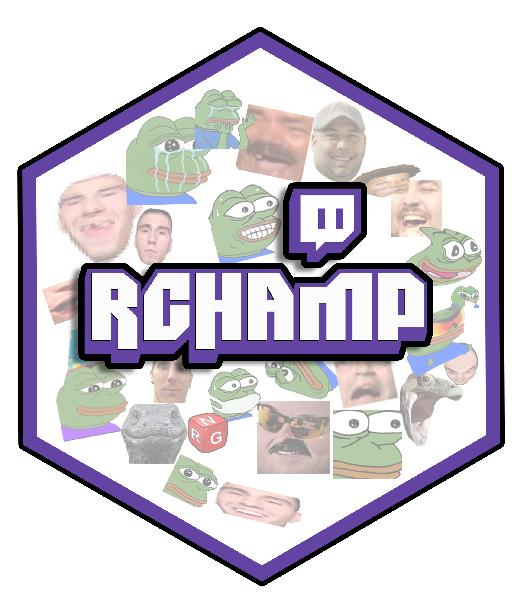
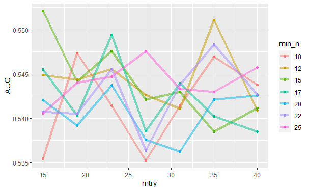
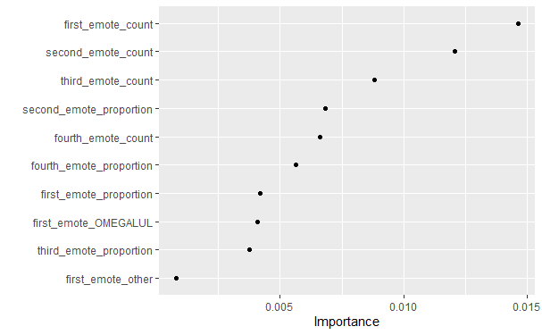

```{r setup, include=FALSE}
options(htmltools.dir.version = FALSE)
knitr::opts_chunk$set(
  fig.width=9, fig.height=3.5, fig.retina=3,
  out.width = "100%",
  cache = FALSE,
  echo = TRUE,
  message = FALSE, 
  warning = FALSE,
  fig.show = TRUE,
  hiline = TRUE
)
```

```{r xaringan-themer, include=FALSE, warning=FALSE}
library(xaringanthemer)
style_duo_accent(
  primary_color = "#6441A4",
  secondary_color = "#FF961C",
  inverse_header_color = "#FFFFFF"
)
```


# Before we begin

.pull-left[

Imagine a community of users that talk about coffee and share coffee related content. 

The content can range from a discussion about coffee regions to instructional videos about the coffee making process. With most members using lingo that coffee enthusiasts are familiar with.
This is essentially what a subreddit is!


]

--
.pull-right[

```{r,echo=FALSE}

url <- 'https://lh3.googleusercontent.com/sieO8dzYHEYrz4xUoZ9WQnSsiebPpyFpAByKoyzUZIbmlSGsj6WtNZEVHBlknoWF0KDHJPHMtUhlEs_OoZ9Mq9XOuEI1RpRBc1PrF0Y7n1qUxa9NJ53jv1k1OQBJrK8oLpV_mAw8aY4'

knitr::include_graphics(url)

```

]

---
# What is Livestreamfail

Livestreamfail (LSF) is a subreddit consisting of over 1 million users worldwide. My previous analysis of LSF indicated that the majority of the content posted to LSF were Twitch related. 


--
In fact, most users would agree that most of the content on LSF are ‘Twitch Clips’ which are highlight portions of a livestream found on Twitch. 


--
You can compare a Twitch clip to brief highlight of your favorite T.V. show with typed comments by the audience.

--
.pull-left[
A look into LSF will show you that people post Twitch clips, comments on posts and recieve karma (points) from upvotes (likes). It's not uncommon, for teams of people use LSF to platform a growing streamer, or shed light into an on going issue within Twitch. This is why understanding how LSF works can give an advantage to streamers, Twitch and sponsors looking to grow a community and build a brand. 
]

.pull-right[
```{r,echo=FALSE, out.height='90%', out.width='90%'}

knitr::include_graphics('https://lh4.googleusercontent.com/McgrYLOx0AdF6xd-PB1l1863X4867Ik1U3gDc6btwV_FSokVzMx3pYfqAxxhotrGqBn2GcimokKnRW2xj_F-jCoX1xSu67PzFOcujLFl')

```
]

---
# Let's look at a Twitch Clip

.left-column[
A 60 second, short video of the streamer playing a video game. 


Notice the use of emotes in the live chat on the right hand side. 

]


.right-column[
```{r,echo=FALSE}

knitr::include_graphics('https://lh6.googleusercontent.com/VhL4fVmncyLKaukrsi7f_tHPK1dwsfAb4r8DQavCGhtyH_v4VvQ8ARz_x5V8aK5_tzZWWsnulv6LCW5bsiCTWKWXctbQqpXOhaxgRuNFpfFViMGr7z4Z-IKAg1RBiD1KKMQnl9TvJ9Q')

```
]


---
# What are Emotes

What separates ‘live streaming’ from traditional ‘live’ sports, news, or podcasts are the interactions between the viewers and ‘streamers’ in real-time. The viewers have the ability to chat to the ‘streamer’ using plain text and emojis.. Or emotes!
Just like emojis, emotes are used to express some sort of emotion. Generally, emotes are used to react to what is being said or shown on the stream. 
But better than emojis, emotes are custom to Twitch and it’s community. 

--

.center[
```{r, echo=FALSE, out.height='50%',out.width='50%'}

knitr::include_graphics('https://lh6.googleusercontent.com/lmQ52IfA5IFZ-uz4aNeqvXh8yI1dSpjxjhmrACH-dbk6F-vLte77YV5A9vZfptL3pkWodg44PyxH2RKVJGWC5fHnQr0tpQMDLOpUY7Q')

```
]


--

.pull-left[

The Twich culture have a language using twitch emotes and third-party emotes that cannot be easily interpreted from the visuals themselves. 

]

.pull-right[

```{r,out.height='20%', out.width='20%', echo=FALSE}

knitr::include_graphics('https://i.kym-cdn.com/photos/images/original/001/873/318/c4b.png')


```

]

---
# Previous Work
.pull-left[

My previous analysis of twitch emotes revealed the possibility of uncovering similar community members based off of emote use alone. Since I could infer the sentiment from a Twitch clip using emotes, what about the sentiment of a community more generally?

]


.pull-right[

```{r,echo=FALSE,out.height='60%', out.width='60%'}

knitr::include_graphics('https://lh3.googleusercontent.com/X-kk0jsTll0aJ0dHjixcpRYyIWj2HTn_3xyI-l44WP8OZqQnw4zUopDSEMnjCvZSWTQpvYsdf2KK0Ga5E9D7PMDmRYTGrW1FO6llykHqahmxXOsUbXG14elO7tmZdKwfQYB6pc6LmpE')

```
]

--

This is a network graph connecting two streamers XqC and Forsen by emotes that were most correlated through their twitch clips featured on LSF. This graph only features 3rd party emotes. This limitation was addressed though Rchamp. 

???
Kind of like finding the similarities between celebrity communities from the emojis community members use. 


---
# But why?

Since emotes are generally used to react to what is being shown on stream and can be used to infer the status of broadcast, couldn’t we use them to infer if a twitch clip is ‘funny’, ‘amazing’, ‘heartbreaking’?


<br>

--
Wouldn’t you think that a twitch clip that has a lot of ‘😂’ or more ‘LULWs’ would do well in a subreddit like Livestreamfail? Recent feedback from LSF on my prevous work suggest that is possible! 


<br>
--

<br>
Understanding the power of emotes and the influence of LSF would be benifical for growing streamers, company sponsors and Twitch to grow the community and build products.  

 
---
# How am I doing this

Until now, an R package to navigate the Twitch API to collect chat data from a VOD or Twich clip did not exist. 

--
.center[
So I built Rchamp.
]

--
.pull-left[
```{r,out.height=350, out.width=350,echo=FALSE}




```
]

.pull-right[

The main purpose of this package is to enable other useRs to wrangle Twitch chat from Twitch clips (or VODs) into a neat dataframe. Unlike some of it's python counter-parts, it will also return global emotes used, user badge present (1st one), subcribed months, and optional JSON output. 

The package is public and I'm open to contributions!

github.com/mowgl-i

]


---
# Data Collection

This data was collected using some python (PRAW) and R (Rchamp) and combined into one dataset containing 817 observations. 

```{r,out.height='40%',out.width='40%', echo=FALSE}
library(DT)
lsf_and_chat <- read.csv('lsf_and_chat.csv')

datatable(lsf_and_chat, rownames = F,extensions = 'FixedColumns', options = list(dom='t',scrollX=TRUE, scrollCollapse=TRUE,initComplete = JS(
        "function(settings, json) {",
        "$(this.api().table().container()).css({'font-size': '70%'});",
        "}")))

```


---
# Classification: Random Forest

I've seperated the data into 'Successful' and 'Not-Successful' categories based off of the score the post recieved. 

<br>
--
After creating the labels, I could begin to train a supervised machine learning model. 

<br>
--
Since this hasn’t been done yet, I decided to train a Random Forest model for its simplicity and easy to understand implementation. I deployed hyper-parameter tuning on this model to give the best possible classification results using Area under the Curve (AUC). 

<br>
--
Despite the model not performing well (**SPOILER**)... some interesting have been learned and can still be learned. 

---
# Random Forest: Model evaluation

The best possible model that can be derived from this data using RF produces and accuracy of 69.9% and an AUC score of 59.8%. Sensitivity is 0.94 and Specificity is 0.07. This would suggest that the model is good a predicting which posts are successful(viral), while being bad at indentifying posts that are not successful. 

.pull-left[

```{r,echo=FALSE}



```

]


.pull-right[
```{r,echo=FALSE}

```


]
 


